<div align="center">



<br/>

[](https://git.io/typing-svg)

<br/>

[](https://linkedin.com/in/ishan-mehra1)
[](https://leetcode.com/ishanmehraa)
[](mailto:ishanmehra04@gmail.com)
[](https://github.com/ishanmehra)

</div>

---

## Systems I own in production

I'm the only backend engineer at **[Edzy](https://edzy.in)**, working directly with the founder on architecture. Everything below is live, and I built it end to end — design, implementation, deployment, monitoring.

<table>
<tr>
<td width="50%" valign="top">

### Prompt Rendering Template System
`Node.js` · `BullMQ` · `multi-model LLM` · `MongoDB`

A hierarchical AI content pipeline covering **1,500+ educational content types** across exam, subject, book, chapter and topic levels.

Templates accept multiple `referenceId`s; at execution, the relevant data is fetched on the fly and injected to produce a fully populated prompt instance. A queue scanner watches the `shouldGenerate` flag and dispatches ready prompts automatically, so generation stays decoupled from whatever triggered it.

Generated worksheets and revision guides flow back through a dedicated ingestion endpoint — a fully autonomous loop.

</td>
<td width="50%" valign="top">

### Boop — campaign automation platform
`Node.js` · `BullMQ` · `Redis` · `event-driven`

Reusable communication platform across **SMS, Email, Push, Telegram and Discord**.

**50+ campaigns/day · 9,700+ message instances/month · 900+ unique users · 89% delivery success**

Distributed job queue and scheduler handling both relative and absolute time triggers, a dynamic template engine for real-time variable injection, and event-driven hooks on badges, competitions, joins and status transitions. Internal dashboard tracks delivery, failure reasons, retry counts and error patterns.

</td>
</tr>
<tr>
<td width="50%" valign="top">

### Apple Pay integration
`Node.js` · `webhooks` · `subscriptions`

Webhook event processing that captures and validates the full payment lifecycle, persists subscriptions, and keeps user entitlements in sync across Edzy's backend.

</td>
<td width="50%" valign="top">

### Multi-model LLM layer
`configurable model selection` · `concurrent processing`

A model-selection layer sitting in front of several LLM providers, with a dedicated processing queue issuing concurrent calls for high-throughput generation.

</td>
</tr>
<tr>
<td width="50%" valign="top">

### Chatbots — WhatsApp + in-app
`LLM integration` · `RAG` · `context pipelines`

Two scoped assistants for study-related help, so students get curriculum-specific answers without leaving their workflow.

</td>
<td width="50%" valign="top">

### Chrome Extension backend
`YouTube transcription` · `context windows`

A YouTube-to-Edzy mapping engine that reads the active video and surfaces relevant content items, plus context-aware chat that uses the transcript and extracted metadata as the LLM context window for video-grounded answers.

</td>
</tr>
<tr>
<td width="50%" valign="top">

### SEO & data intelligence pipeline
`CommonCrawl` · `Search Console API` · `JSON-LD`

CommonCrawl analysis to map competitor backlink profiles and find link-building opportunities, wired to Google Search Console for keyword and failing-URL data — driving structured-metadata and URL-slug strategy.

</td>
<td width="50%" valign="top">

### Real-time duel engine
`WebSockets` · `synchronised state`

Multiplayer academic duels with synchronised game state, session and participant tracking, and live updates for everyone watching.

</td>
</tr>
</table>

---

## How I think about systems

```typescript
const ishan = {
  role:     "Backend Developer @ Edzy",
  since:    "Sep 2025",
  based:    "New Delhi / Gurugram, India",
  openTo:   ["Backend roles in Czech Republic", "Gurugram / Noida / Delhi NCR"],
  relocate: "Open to relocation · EU Blue Card eligible",

  stack: {
    runtime:   ["Node.js", "Express.js", "TypeScript"],
    queues:    ["BullMQ", "Redis"],
    databases: ["MongoDB", "PostgreSQL", "MySQL"],
    infra:     ["AWS EC2", "PM2", "GitHub Actions CI/CD"],
    ai:        ["multi-model LLM integration", "prompt engineering", "RAG pipelines"],
    protocols: ["REST", "WebSockets", "Webhooks"],
    auth:      ["JWT", "RBAC"],
  },

  principles: [
    "Own the system, not the ticket",
    "Queues over direct calls — decouple by default",
    "Design for failure first, then for throughput",
    "If you can't see it fail, you haven't shipped it",
  ],
} as const;
```

---

## Stack

**Runtime & language**


**Queues, cache & events**


**Databases**


**AI & LLM**


**Infra & tooling**


**Auth & payments**


---

## Experience

**Backend Developer** — Edzy, Gurugram · `Sep 2025 – Present`
Sole backend developer in a cross-functional team, collaborating directly with the founder on system design, architecture decisions and feature-level infrastructure planning. Deployments automated with GitHub Actions; services run on AWS EC2 under PM2 for zero-downtime restarts. Applied database indexing and query optimisation as the systems above scaled.

**Backend Software Development Intern** — Novostack Pvt. Ltd., Noida · `Oct 2024 – Feb 2025`
Built RESTful APIs across several client projects in Node.js and Express, including a FinTech admin dashboard covering transactions, analytics and role-based access control. Cut API response times **20%** through query optimisation, indexing and caching. Implemented JWT auth with role-based authorisation and shipped **3 production systems** on schedule.

---

## Projects

**[Zagio](https://github.com/ishanmehra/zagio)** — anonymous group chat
`Node.js` · `Express.js` · `MongoDB Atlas` · `Cloudinary` · `JWT`
Privacy-focused chat platform with JWT authentication, role-based access and real-time group messaging. Anonymous by design, with no cross-user identity leakage.

**[Book Review Platform](https://github.com/ishanmehra/book-review)** — read-heavy API
`Node.js` · `PostgreSQL` · `Sequelize` · `Redis`
APIs for browsing, reviewing and rating books, with a Redis caching layer built for read-heavy access patterns.

---

## Education & certifications

**B.Tech, Computer Science** — Dr. A. P. J. Abdul Kalam Technical University, Ghaziabad · `2021 – 2025`
Graduated First Division. Focus on data structures, algorithms and backend architecture.


---

## GitHub

<div align="center">


<br/><br/>


<br/><br/>


</div>

---

## Open to work

Actively looking for backend engineering roles in the **Czech Republic**, and strong opportunities across **Gurugram, Noida and Delhi NCR**.

What I bring: Node.js and event-driven architecture in production, AI/LLM pipelines that run unattended, and the track record of owning backend infrastructure solo from day one.

[](mailto:ishanmehra04@gmail.com)
[](https://linkedin.com/in/ishan-mehra1)

<div align="center">

<br/>

<sub>Distributed systems, tight deadlines, zero hand-holding — that's where I work best.</sub>


</div>
